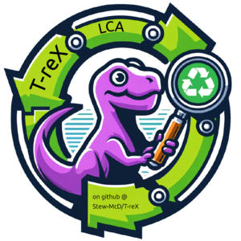

# T-reX for LCA: Publication repository

This repo contains the manuscript and data associated with the [T-reX](https://github.com/Stew-McD/T-reX) python program developed by the authors for waste and material footprinting in Life Cycle Assessment studies (currently under peer review).

- See the preprint version of the manuscript [here](https://github.com/Stew-McD/T-reX_Publication/blob/main/home/00_JRR-submission-folder_elsevier-latex-template_COMPLETED/cas-dc-template.pdf)
- Commented draft versions from are in the [reviews](https://github.com/Stew-McD/T-reX_Publication/blob/main/reviews) directory.
- Comments and insults are most welcome. If they are short, use the 'issues' tab or email me, otherwise, please annotate the pdf and send it back to me.
- Drafted according to the submission guidelines for the journal of Resources Conservation and Recycling [(see summary here)](ResourcesConservationAndRecycling_SubmissionRequirements.pdf)

## Graphical abstract

## T-reX method flowcharts

