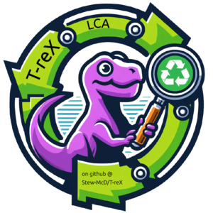
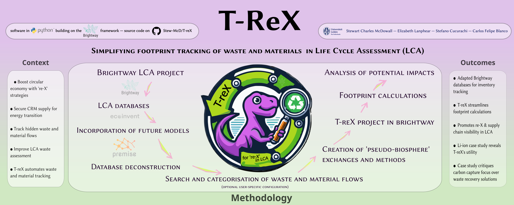
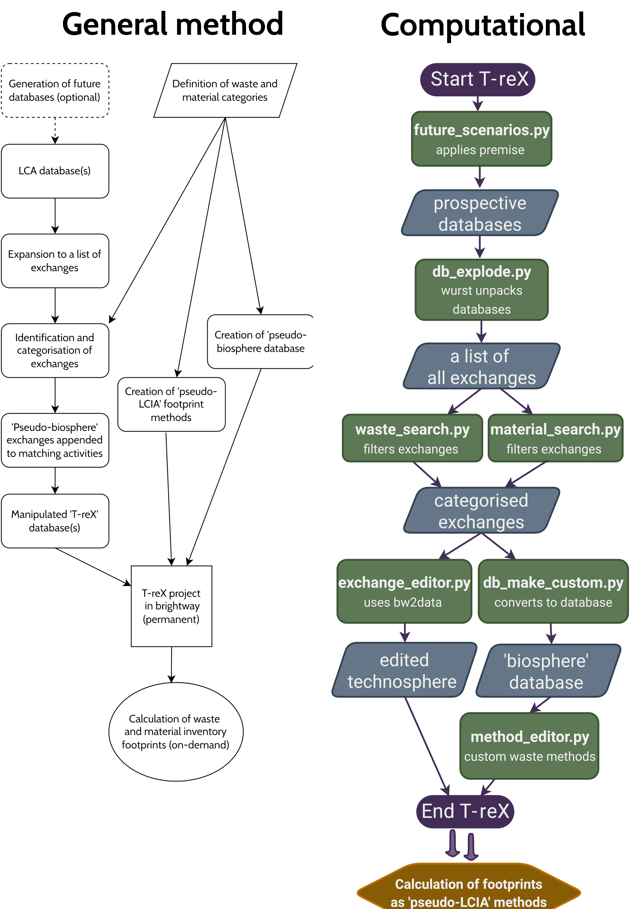

# T-reX for LCA: Publication Repository

This repository contains the manuscript and data associated with the [T-reX](https://github.com/Stew-McD/T-reX) Python program, developed by the authors for waste and material footprinting in Life Cycle Assessment (LCA) studies. The manuscript is in the pre-print stage (at 2024-12-01), submitted and reviewed by the journal *Resources, Conservation & Recycling* - [(web link)](https://www.sciencedirect.com/journal/resources-conservation-and-recycling).

    

## Contents
- See the preprint version of the manuscript [here](https://github.com/Stew-McD/T-reX_Publication/blob/main/home/20241201_T-reX_preprint-main.pdf).
- The peer review process is documented in the [reviews directory](https://github.com/Stew-McD/T-reX_Publication/blob/main/04_T-reX_manuscript-review-documents).
- Feedback is welcome!  
  - For brief comments, use the 'Issues' tab or email me.  
  - For detailed feedback, annotate the PDF and send it back to me.  
- Drafted according to the submission guidelines for the journal *Resources, Conservation & Recycling* - [(web link)](https://www.sciencedirect.com/journal/resources-conservation-and-recycling/publish/guide-for-authors).

## Graphical Abstract

    

## T-reX Method Flowcharts

    

