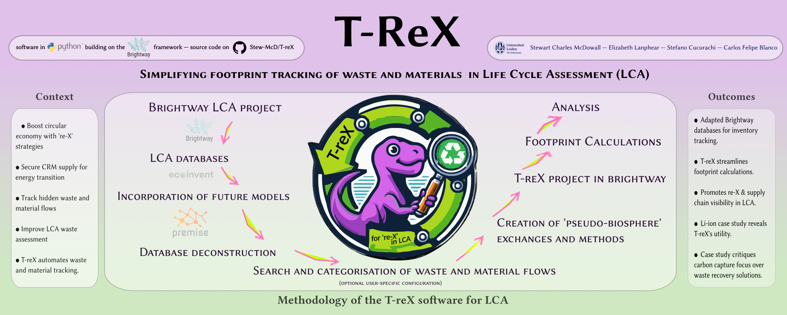

# T-reX-Publication

This repo contains the manuscript and data associated with the T-reX program for LCA (currently a draft under internal review).

- See the preprint version of the manuscript [here](https://github.com/Stew-McD/T-reX_Publication/blob/main/00_JRR-submission_folder/00_T-reX_manuscript.pdf)
- Commented draft versions from are in the [reviews](https://github.com/Stew-McD/T-reX_Publication/blob/main/reviews) directory.
- Comments and insults are most welcome. If they are short, use the 'issues' tab or email me, otherwise, please annotate the pdf and send it back to me. Thanks!! x
- Drafted according to the submission guidelines for the journal of Resources Conservation and Recycling [(see summary here)](ResourcesConservationAndRecycling_SubmissionRequirements.pdf)

<!--  -->

